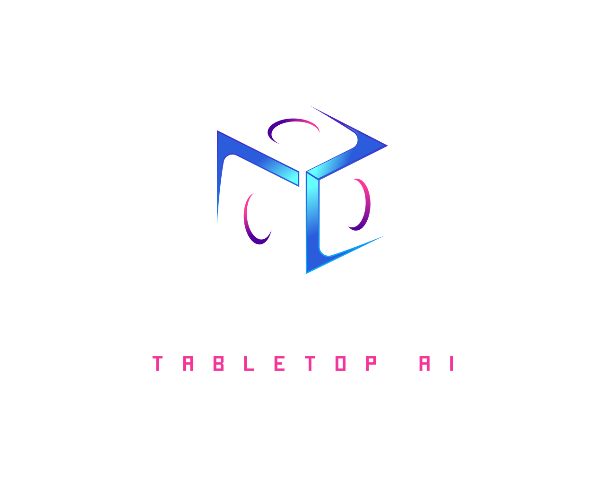

<p align="center">
  
</p>

<p align="center">
  <a href="https://github.com/vitorfdl/narratrix/releases/latest"></a>
  <a href="https://narratrixai.com/#download"></a>
  <a href="https://github.com/vitorfdl/narratrix/actions/workflows/code-quality.yml"></a>
  <a href="https://discord.gg/Q69R4aWCFR"></a>
</p>

<p align="center">
  <a href="https://narratrixai.com/#download">Download</a> ·
  <a href="https://github.com/vitorfdl/narratrix/wiki">Wiki</a> ·
  <a href="https://discord.gg/Q69R4aWCFR">Discord</a> ·
  <a href="https://www.patreon.com/NarratrixAI">Patreon</a>
</p>

---

# NarratrixAI

NarratrixAI is a desktop app for AI-assisted roleplay and tabletop campaigns. Create characters, keep track of their stats and inventory, organize your world's lore, and configure the prompts and tools the AI uses during play.

I started building it in early 2025 because I wanted my campaign tools together: character sheets beside the conversation, world notes I could reuse, and automations I could inspect and change. I also wanted to choose my own models and keep the app's data on my machine.

<p align="center">
  
</p>

## Get started

Download an installer from [narratrixai.com](https://narratrixai.com/#download) or the [GitHub releases page](https://github.com/vitorfdl/narratrix/releases).

Builds are available for:
- Windows
- macOS on Apple Silicon and Intel
- Linux as `.deb`, `.rpm`, and AppImage

You'll need to connect a model before starting a chat. Use your own API credentials for a supported provider or connect to a model you host yourself.

Follow the [model setup guide](https://github.com/vitorfdl/narratrix/wiki/Setting-Up-Models) to configure your connection. The [wiki](https://github.com/vitorfdl/narratrix/wiki) covers characters, chats, and other features. If you get stuck, ask in [Discord](https://discord.gg/Q69R4aWCFR).

## Features

### Arrange your workspace

Each chat has a board you can customize with widgets for messages, participants, character sheets, generation controls, expressions, chapters, memory, and scripts.

Drag and resize the widgets to suit your session, then save the layout for next time.

### Characters and sheets

Give characters a personality, avatar, and expression pack. Use their sheets to track stats, inventory, spell slots, relationships, or anything else your story needs.

Build sheet templates in a drag-and-drop editor with text, numbers, dropdowns, lists, and tables. Calculated fields can reference other values, so a modifier updates when its stat changes. Start with the included D&D 5E or Novel Protagonist template, or create your own.

**Sheet values changed during a chat belong to that chat.** They don't change the character's defaults. Template edits are shared across every character using that template.

See the [character sheet guide](https://github.com/vitorfdl/narratrix/wiki/Character-Sheets) for templates, calculations, and using sheet values in prompts.

### Lorebooks

Store reusable information about your world, including locations, factions, people, and rules.

Entries can be selected by keywords, similarity to the conversation, or both, then included in the model's context. A test dialog lets you check which entries a prompt would include and why.

### Tools and agents

Give the AI tools to roll dice, ask you a question, or read and update a character's sheet. You choose which tools are available, and their calls appear inside the conversation so you can inspect the requests and results.

AI tool use requires a model that supports tool calling. See the [chat template guide](https://github.com/vitorfdl/narratrix/wiki/Chat-Template) for configuration.

For custom automation, build agents in a node editor. Combine JavaScript, prompts, dice, lorebook searches, sheet updates, and player choices. Agents can run around messages, at intervals, manually, or as tools the AI can call.

### Prompts and imports

Customize the instructions and context sent to your model. Templates can include character information, lore, memory, chapter details, and sheet values through placeholders such as `{{char.sheet}}` and `{{user.name}}`.

You can also import SillyTavern presets and character cards.

### Model connections

Connect to OpenAI, Anthropic, Google Gemini, OpenRouter, AWS Bedrock, Ollama, or an OpenAI-compatible endpoint.

Model and embedding providers use editable manifests, allowing you to customize their configuration. Embedding models support similarity-based lorebook searches.

<p align="center">
  
</p>

### Profiles and local storage

Keep separate collections of characters, chats, API keys, and settings in different profiles. App data is stored locally, and API keys are encrypted at rest.

When you use a cloud model, the prompt and included context are sent to the provider you configured.

## Build from source

NarratrixAI uses [Tauri](https://tauri.app/), React, TypeScript, Rust, and SQLite.

### Prerequisites

- Node.js 24 or newer
- [pnpm](https://pnpm.io/), using the version declared in `package.json`
- A stable Rust toolchain
- The [Tauri system dependencies](https://tauri.app/start/prerequisites/) for your operating system

### Run the desktop app

```bash
git clone https://github.com/vitorfdl/narratrix.git
cd narratrix
pnpm install
pnpm tauri dev
```

The last command starts the desktop app in development mode with hot reload.

### Development commands

```bash
pnpm tauri dev    # Full desktop app with hot reload
pnpm dev          # Frontend only, in the browser
pnpm test         # Vitest
pnpm lint:fix     # Biome format and safe fixes
pnpm build        # Type-check and production frontend build
```

### Project structure

```text
src/pages/        Chat, characters, agents, lorebooks, models, and settings
src/components/   Shared UI, markdown editor, dialogs, and inspector
src/services/     Inference, prompt formatting, agents, imports, and exports
src/hooks/        React hooks and Zustand/Jotai stores
src/schema/       Zod schemas and validation
src-tauri/        Rust backend, SQLite migrations, encryption, and token counting
src-tauri/resources/manifests/   Bundled model, embedding, and character manifests
```

## Contribute

Pull requests, bug reports, and feature ideas are welcome. If you're still working through an idea, bring it to [Discord](https://discord.gg/Q69R4aWCFR).

Before opening a pull request:

- Keep changes focused on one concern.
- Use Conventional Commit subjects.
- Follow the nearby code patterns and the conventions in [AGENTS.md](AGENTS.md).
- Run `pnpm lint:fix`, `pnpm build`, and `pnpm test`.
- Never commit API keys, tokens, credentials, or local profile data.

If you'd like to support development, [Patreon](https://www.patreon.com/NarratrixAI) helps cover the model costs involved in testing.

## License

The source code is licensed under the [GNU Affero General Public License v3](LICENSE).

See also the [NarratrixAI End User License Agreement](LICENSE_2) for additional terms.
